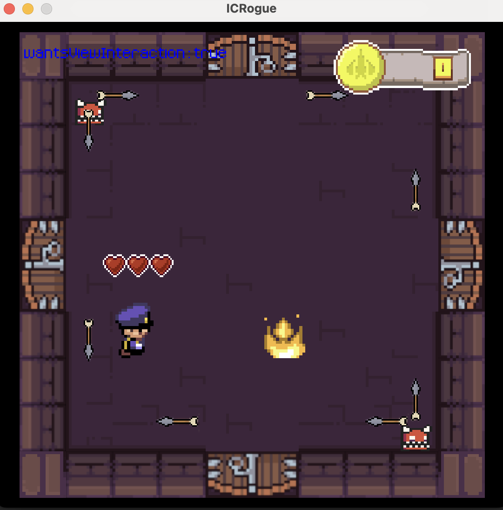

<h1 align="center">Rogue-Game </h1>

  

<i>An exciting dungeon crawler adventure awaits!</i>

Welcome to **Rogue-Game**, a thrilling dungeon crawler game with two levels of challenges. The first level features a randomly generated map, while the second level has a fixed map.

## How to Run

To run the game:
1. Open the project in IntelliJ.
2. Run the main class.
3. Play the game by executing the file under `out` (compiled).

## Controls

- **Arrow Keys**: Move the character/navigate the shop.
- **X**: Cast a fireball.
- **P**: Open the shop.
- **R**: Reset the character's position to the starting point in the current room.
- **ESC**: Close the shop.
- **ENTER**: Confirm the purchase of a skin/equip the skin.
- **W**: Accept/decline remote interaction (default is to decline).

## Gameplay Mechanics

### Health Points (HP)
- The character starts with 6 HP, represented by three hearts.
- Each half-heart represents 1 HP.
- Collecting heart items in the game increases HP by 1 point per item.

### Completing a Room
- To complete a room, collect all items and defeat all enemies, if present.
- If a room has no items or enemies, it is completed upon entry.

### Completing a Level
- If the level contains a boss room, completing the boss room completes the level.
- Otherwise, complete all rooms in the level.

### Using the Shop
- Press `P` to open the shop.
- Use the arrow keys to select a skin and press `ENTER` to purchase it.
- If your balance is insufficient, nothing happens.
- If the skin is already owned, press `ENTER` to equip it.

### Earning Money
- Collect coins found in the rooms to increase your balance by one per coin.

### Defeating Enemies
- The character can defeat enemies by stepping on them.
- If equipped with a staff, the character can shoot fireballs to defeat enemies.

### Character Animation with a Sword
- If the character is a basic type and has a sword, a short animation plays when defeating an enemy with remote interaction.

### Enemy Attack Mechanism
- Stationary turrets shoot arrows in all free directions every 2 seconds.
- Arrows deal 1 point of damage upon hitting the character.

## Game End Conditions
- **Win**: Complete all levels.
- **Lose**: The character loses all HP.

## Added Features
- **Objects**: Sword, coin, heart.
- **Animations**: Sword, coin, heart, fireball, 4 character types.
- **Currency System**: Current balance displayed at the top right.
- **Shop System**: Spend currency to purchase items.
- **Health System**: 3 hearts representing 6 HP displayed above the character.
- **Rooms**: Healing room, room with a sword.
- **Status Display**: Boolean indicating desire for remote interaction (wantsCellInteraction: true/false) displayed at the top left.
